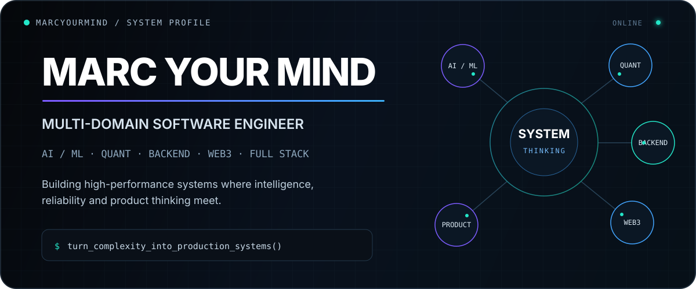
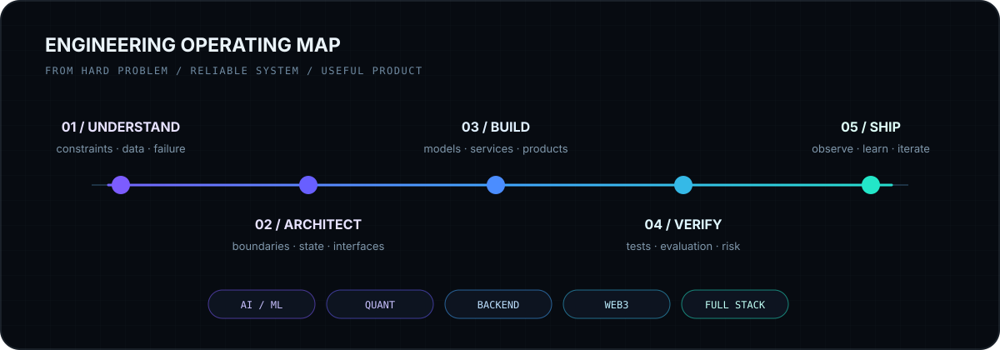

<!--
  MarcYourMind / GitHub Profile README
  Designed to be committed to: github.com/MarcYourMind/MarcYourMind
  Custom artwork lives in ./assets
-->

<div align="center">
  <a href="https://marcyourmind.github.io/">
    
  </a>
</div>

<p align="center">
  <a href="https://marcyourmind.github.io/"></a>
  <a href="https://marcyourmind.github.io/projects"></a>
  <a href="https://marcyourmind.github.io/articles"></a>
  <a href="mailto:mgtojar@gmail.com"></a>
</p>

<p align="center">
  <a href="https://github.com/MarcYourMind?tab=followers"></a>
  <a href="https://github.com/MarcYourMind?tab=repositories"></a>
  
</p>

<br/>

<table>
<tr>
<td width="58%" valign="top">

## `01 / PROFILE`

I build **high-performance software systems** across disciplines that are usually treated as separate worlds:

**AI / ML · Quantitative Engineering · Backend Systems · Web3 · Full-Stack Product**

The common thread is not a framework or language. It is the kind of problem I like: systems with **real constraints, non-trivial architecture, failure modes that matter, and enough complexity to reward first-principles thinking**.

My work includes custom Transformer models, autonomous multi-agent systems, real-time trading infrastructure, low-latency C++, smart contracts, cloud platforms, computer vision and complete user-facing products.

I care about what happens **after the demo works**: correctness, evaluation, observability, risk, performance, maintainability and whether the product is actually useful.

</td>
<td width="42%" valign="top">

## `SIGNAL`

| | |
|---|---:|
| **Engineering experience** | `6+ years` |
| **Project portfolio** | `30+ projects` |
| **Professional certifications** | `8+` |
| **Languages / technical languages** | `19` |
| **Primary operating mode** | `systems thinking` |
| **Default objective** | `ship reliably` |

**Current portfolio thesis**

> Build intelligent systems without making them fragile.

</td>
</tr>
</table>

---

## `02 / OPERATING SYSTEM`

<div align="center">
  
</div>

The technology changes. The process does not: **understand the constraints, architect the system, build the smallest correct version, attack its failure modes, then ship and observe it in reality.**

---

## `03 / DOMAIN MATRIX`

<table>
<thead>
<tr>
<th width="20%">Domain</th>
<th width="32%">What I build</th>
<th width="48%">Where I go deep</th>
</tr>
</thead>
<tbody>
<tr>
<td><b>AI / ML</b></td>
<td>Models and intelligent systems that reason, classify, generate or coordinate work.</td>
<td>Transformers, multi-agent systems, local LLMs, evaluation, computer vision, feature engineering, inference pipelines.</td>
</tr>
<tr>
<td><b>Quant / Trading</b></td>
<td>Research and execution infrastructure for systematic decision-making in markets.</td>
<td>Market data, backtesting, statistical models, state machines, execution, portfolio logic, risk controls.</td>
</tr>
<tr>
<td><b>Backend</b></td>
<td>Services and infrastructure designed to keep working under load and failure.</td>
<td>FastAPI, distributed systems, event-driven architecture, APIs, cloud infrastructure, data pipelines, PostgreSQL.</td>
</tr>
<tr>
<td><b>Web3</b></td>
<td>Trust-minimised systems with programmable value and deterministic settlement.</td>
<td>Solidity, Ethereum, Solana, escrow, automated payouts, wallet connectivity, market-making infrastructure.</td>
</tr>
<tr>
<td><b>Full Stack</b></td>
<td>Complete products where strong engineering reaches a clear, useful interface.</td>
<td>React, Next.js, TypeScript, interaction design, visual systems, performance, product architecture.</td>
</tr>
</tbody>
</table>

---

# `04 / FLAGSHIP SYSTEMS`

Not tutorial projects. Not cloned dashboards. These are the systems that best represent how I think.

<table>
<tr>
<td width="50%" valign="top">

### 01 · CryptoGPT
**Custom Transformer for market intelligence**

A purpose-built Transformer pipeline for identifying market direction in low-volatility crypto environments, with a heavy emphasis on feature engineering and eliminating data leakage.

**Proof**
- **60.4% accuracy on unseen data**
- Real-time feature engineering pipeline
- Parallel CPU / GPU training
- Generalisation validation across crypto assets

**Stack**  
`Python` `PyTorch` `Transformers` `Pandas` `Scikit-learn`

[Case study](https://marcyourmind.github.io/projects/cryptogpt) · [Technical deep dive](https://marcyourmind.github.io/articles/transformer-trading-systems)

</td>
<td width="50%" valign="top">

### 02 · AiTrader
**Production-minded multi-agent market system**

An LLM-powered trading architecture in which specialised agents perform distinct analysis functions while a central orchestrator maintains shared state and evaluator agents validate intermediate outputs.

**Proof**
- **20+ specialised sub-agents**
- Single-source-of-truth architecture
- Dedicated evaluator agents
- Monitoring for agent performance
- Testing designed specifically for LLM and prompt reliability

**Stack**  
`Python` `LangChain` `FastAPI` `Ollama` `Pydantic`

[Case study](https://marcyourmind.github.io/projects/aitrader) · [Architecture deep dive](https://marcyourmind.github.io/articles/machine-learning-pipelines-production)

</td>
</tr>
<tr>
<td width="50%" valign="top">

### 03 · TopTrader
**Trading infrastructure built around discipline**

A unified trading platform that combines market screening, risk management, automated execution, journalling, behavioural analysis and multi-exchange connectivity.

**Proof**
- **100+ crypto exchanges** through CCXT
- Multiple algorithms running simultaneously
- Automated position sizing and execution
- Behavioural analytics and enforced journalling
- 100+ educational videos integrated into the product

**Stack**  
`React` `TypeScript` `Next.js` `FastAPI` `Python` `PostgreSQL` `CCXT`

[Case study](https://marcyourmind.github.io/projects/toptrader)

</td>
<td width="50%" valign="top">

### 04 · Cervantes
**Local-first autonomous story generation**

A hierarchical multi-agent system that separates narrative planning, generation and evaluation, using local LLMs to preserve privacy and remove recurring inference costs.

**Proof**
- Planner / Writer / Evaluator architecture
- Iterative quality loop
- Fully local inference
- **$0 API cost**
- Long-form narrative generation

**Stack**  
`Python` `LangChain` `Ollama` `Gradio`

[Source](https://github.com/MarcYourMind/Cervantes-AI-Story-Writer) · [Case study](https://marcyourmind.github.io/projects/cervantes) · [Article](https://marcyourmind.github.io/articles/cervantes-ai-storyteller)

</td>
</tr>
<tr>
<td width="50%" valign="top">

### 05 · NASDAQ Futures System
**Low-latency C++ execution**

A client trading system that translated a manually traded strategy into automated real-time execution using a state machine and direct Interactive Brokers integration.

**Published case-study metrics**
- **80% ROI in year one**
- **<25% maximum drawdown**
- **100+ simulations**
- Real-time execution and statistical risk controls

**Stack**  
`C++` `Interactive Brokers` `State Machines` `Risk Controls`

[Case study](https://marcyourmind.github.io/projects/nasdaq)

</td>
<td width="50%" valign="top">

### 06 · Chain Champions
**Trustless tournament infrastructure**

A Web3 gaming platform with smart contracts for escrow, tournament buy-ins and automatic prize distribution, connected to a cloud-backed application layer.

**Engineering focus**
- Gas-conscious Solidity
- Escrow and automated payouts
- Wallet connectivity
- Smart-contract exploit mitigation
- Backend / blockchain state synchronisation

**Stack**  
`Solidity` `React` `Node.js` `TypeScript` `GCP` `Ethereum`

[Case study](https://marcyourmind.github.io/projects/chainchampions) · [Security deep dive](https://marcyourmind.github.io/articles/smart-contract-security-web3-gaming)

</td>
</tr>
</table>

<p align="center">
  <a href="https://marcyourmind.github.io/projects"><b>Explore the complete project portfolio →</b></a>
</p>

---

## `05 / MORE BUILDS`

| System | Domain | Engineering problem |
|---|---|---|
| **Solana Token Market Maker** | Web3 / Quant | Automated liquidity provision with Raydium, Solana and Web3 infrastructure |
| **CRIPTO Ltd Trading Infrastructure** | Quant / Backend | Multi-exchange research, backtesting, data processing and automated trading infrastructure |
| **GotoVan Logistics Optimizer** | Backend / Product | Routing and graph-optimisation for logistics operations |
| **Dartboard Object Detection** | AI / C++ | Real-time computer vision and object detection with OpenCV |
| **Illuvium Fusion Simulator** | Web3 / Analytics | Market scanning and NFT analytics |
| **HiveFrequency** | Generative AI | Transformer-based generation trained on Drum & Bass audio |
| **Technex** | Backend / Consulting | Cloud architecture, automation and scalable software delivery |
| **3D Snake** | Creative Engineering | Browser-based 3D game engineering with Three.js |

---

# `06 / TECHNICAL ARSENAL`

<div align="center">

### Languages I reach for most


### Product & infrastructure


</div>

<br/>

<table>
<tr>
<td width="33%" valign="top">

### Intelligence
`PyTorch`  
`Transformers`  
`LangChain`  
`Ollama`  
`Scikit-learn`  
`Pandas`  
`NumPy`  
`OpenCV`  
`Agent orchestration`  
`Model evaluation`

</td>
<td width="33%" valign="top">

### Systems
`FastAPI`  
`Node.js`  
`PostgreSQL`  
`MongoDB`  
`REST / OpenAPI`  
`OAuth2`  
`Event-driven systems`  
`Microservices`  
`Docker`  
`Google Cloud`

</td>
<td width="33%" valign="top">

### Markets & Web3
`CCXT`  
`Interactive Brokers`  
`Backtesting`  
`Risk systems`  
`Statistical modelling`  
`Solidity`  
`Ethereum`  
`Solana`  
`Web3.js`  
`Raydium`

</td>
</tr>
</table>

<details>
<summary><b>Open the full technical map</b></summary>
<br/>

**Programming / technical languages**  
Python · C · C++ · Java · JavaScript · TypeScript · Solidity · SQL · HTML · CSS · Haskell · VHDL · Verilog · E · Pine Script · MATLAB / Octave · Dart and others used across academic and project work.

**AI / ML**  
PyTorch · Transformers · LangChain · Ollama · Scikit-learn · Pandas · NumPy · OpenCV · multi-agent architectures · local inference · prompt systems · structured evaluation · feature engineering.

**Backend / distributed systems**  
FastAPI · Flask · Node.js · REST · OpenAPI · OAuth2 · microservices · serverless · asynchronous systems · event-driven architecture · service boundaries · API design.

**Data / infrastructure**  
PostgreSQL · MongoDB · SQL · Google Cloud Platform · Docker · Linux · Git · GitHub · CI/CD patterns · real-time data processing.

**Quantitative engineering**  
CCXT · Interactive Brokers · statistical modelling · Bayesian methods · backtesting · parameter optimisation · market-data pipelines · automated execution · portfolio/risk controls.

**Web3**  
Ethereum · Solana · Solidity · smart contracts · escrow systems · DeFi infrastructure · Web3.js · Raydium · wallet connectivity.

**Frontend / product**  
React · Next.js · TypeScript · Tailwind · Shadcn UI · Three.js · responsive interfaces · interaction design · product architecture.

</details>

---

# `07 / ENGINEERING PRINCIPLES`

<table>
<tr>
<td width="33%" valign="top">

### Correctness > cleverness
A sophisticated system that produces the wrong answer quickly is still wrong.

### Failure is part of the design
Networks degrade. APIs disappear. Models hallucinate. Humans behave unexpectedly. Architecture should assume this.

</td>
<td width="33%" valign="top">

### AI needs systems engineering
The model is only one component. Evaluation, state, observability, deterministic gates, data quality and fallback behaviour make it trustworthy.

### Performance is end-to-end
Latency and throughput emerge from data structures, architecture, I/O, infrastructure and algorithms together.

</td>
<td width="33%" valign="top">

### Product is an engineering constraint
If a technically excellent system is impossible to understand or operate, the engineering is unfinished.

### Complexity must earn its place
Abstraction is useful only when it removes more complexity than it introduces.

</td>
</tr>
</table>

---

# `08 / ENGINEERING NOTES`

I write about the parts of technical work that are usually compressed into a sentence in a portfolio: **architecture decisions, trade-offs, failure modes, data leakage, concurrency, risk, evaluation and the path from prototype to production.**

### Selected writing

**[Architecture of a Production-Grade Multi-Agent Cryptocurrency Trading System](https://marcyourmind.github.io/articles/machine-learning-pipelines-production)**  
Hierarchical orchestration, specialised agents, state, consensus and layered risk.

**[Building a Transformer-Based Trading System](https://marcyourmind.github.io/articles/transformer-trading-systems)**  
Feature engineering, leakage audits, validation and a repeatable ~60% win-rate research pipeline.

**[The 75 Data Design Patterns for High-Scale Trading Platforms](https://marcyourmind.github.io/articles)**  
A large-scale architecture vocabulary for high-throughput market systems.

**[Building Low-Latency Trading Systems: The Plutus Architecture](https://marcyourmind.github.io/articles)**  
Kernel bypass, deterministic execution, concurrency and C++ systems engineering.

**[Smart Contract Security in Web3 Gaming](https://marcyourmind.github.io/articles)**  
Escrow, payout architecture and security lessons from Chain Champions.

**[Cervantes: The Autonomous AI Multi-Agent Storyteller](https://marcyourmind.github.io/articles/cervantes-ai-storyteller)**  
Local LLMs, planning, writing and evaluator loops for long-form generation.

<p align="center">
  <a href="https://marcyourmind.github.io/articles"><b>Read all engineering notes →</b></a>
</p>

---

# `09 / GITHUB`

<p align="center">
  
  
</p>

<p align="center">
  
</p>

<sub>Language cards describe the composition of public repositories, not a proficiency ranking.</sub>

---

# `10 / SELECTED OPEN SOURCE`

<table>
<tr>
<td width="50%" valign="top">

### [Cervantes AI Story Writer](https://github.com/MarcYourMind/Cervantes-AI-Story-Writer)

Multi-agent platform for generating fictional stories, worlds and books with local LLMs.

`Python` `LangChain` `Ollama` `Gradio`

</td>
<td width="50%" valign="top">

### [HiveFrequency](https://github.com/MarcYourMind/HiveFrequency)

A custom Transformer experiment trained on Drum & Bass audio to generate new audio samples.

`Python` `Transformers` `Generative Audio`

</td>
</tr>
<tr>
<td width="50%" valign="top">

### [MPI](https://github.com/MarcYourMind/MPI)

Parallel-computing work modifying stencil code to execute across multiple cores with MPI and OpenMP.

`C` `MPI` `OpenMP` `Parallel Computing`

</td>
<td width="50%" valign="top">

### [Portfolio](https://github.com/MarcYourMind/MarcYourMind.github.io)

The engineering portfolio behind marcyourmind.github.io.

`Next.js` `Frontend` `Technical Writing` `Portfolio`

</td>
</tr>
</table>

---

# `11 / EXPERIENCE SNAPSHOT`

My background crosses software delivery, technical leadership, quantitative engineering and product development.

| Context | Focus |
|---|---|
| **Senior backend engineering** | Python, FastAPI, Open Banking / PSD2-style API systems, schemas and production service design |
| **CTO / technical leadership** | FinTech automation, cloud systems, software delivery and distributed engineering |
| **Quantitative engineering** | Research, backtesting, systematic strategies, market-data infrastructure and execution |
| **Full-stack product engineering** | Logistics optimisation, cloud applications, user interfaces and payment integrations |
| **Web3 engineering** | Solidity, Ethereum applications, escrow, wallet integration and trustless payouts |
| **AI engineering** | Transformers, multi-agent architectures, local LLMs, evaluation and production pipelines |

**Education:** BEng in **Computer Science & Electronics**, University of Bristol.

[Explore specialised resume tracks →](https://marcyourmind.github.io/resume)

---

# `12 / WHAT I AM OPTIMISING FOR`

```text
                          ┌──────────────────────┐
                          │   HARD PROBLEMS      │
                          └──────────┬───────────┘
                                     │
                    ┌────────────────┼────────────────┐
                    │                │                │
              intelligence       systems          product
                    │                │                │
              AI / agents      backend / C++      UX / web
                    │                │                │
                    └────────────────┼────────────────┘
                                     │
                         verification + risk
                                     │
                                     ▼
                          ┌──────────────────────┐
                          │ RELIABLE SOFTWARE    │
                          │ THAT PEOPLE CAN USE  │
                          └──────────────────────┘
```

I am most interested in projects where several disciplines collide:

- Agentic systems that **plan, reason, verify and act**
- AI products where **reliability matters more than the demo**
- High-performance backend and market infrastructure
- Real-time data and decision-support systems
- Human-centred trading technology
- Local and privacy-preserving AI
- Secure programmable-value systems
- Products that make complicated machinery feel simple

---

# `13 / MARCYOURMIND.py`

```python
from dataclasses import dataclass

@dataclass(frozen=True)
class EngineeringDefaults:
    first_principles: bool = True
    question_assumptions: bool = True
    design_for_failure: bool = True
    measure_before_optimising: bool = True
    evaluate_ai_outputs: bool = True
    ship_to_real_users: bool = True


class MarcYourMind:
    domains = (
        "AI / ML",
        "Quantitative Systems",
        "Backend Engineering",
        "Web3",
        "Full-Stack Product",
    )

    def solve(self, problem):
        model = understand(problem)
        architecture = design(model.constraints)
        system = build(architecture)
        evidence = attack_failure_modes(system)
        production = ship(system, evidence)
        return observe_learn_iterate(production)
```

---

<div align="center">

## `OPEN FOR WORLD-CLASS OPPORTUNITIES`

I am interested in technically ambitious teams where ownership is broad, engineering standards are high, and the problem is difficult enough to matter.

**AI Engineering · Quant Systems · Backend Infrastructure · FinTech · Applied ML · Web3 Infrastructure · Technical Product Engineering**

<br/>

<a href="https://marcyourmind.github.io/">
  
</a>
<a href="mailto:mgtojar@gmail.com">
  
</a>

<br/><br/>


</div>
